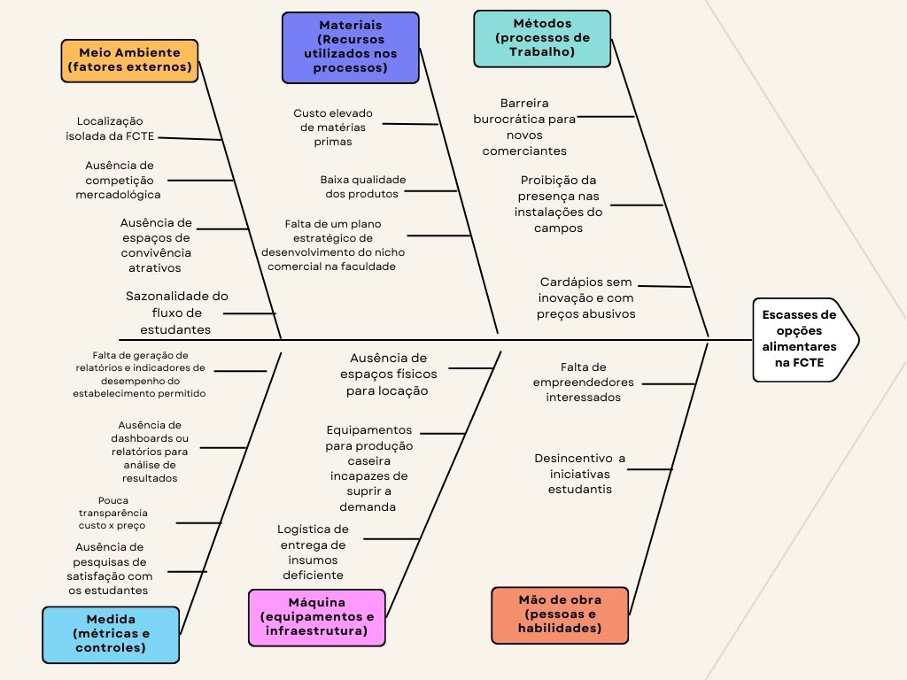

# **Diagrama de Causa e Efeito**

Também conhecido como Diagrama de Ishikawa ou "Espinha de Peixe", esta é uma ferramenta gráfica utilizada para a análise de problemas. Ele permite identificar, categorizar e visualizar as possíveis causas de um efeito ou problema central, organizando-as em grupos para uma análise mais estruturada.

O diagrama é amplamente utilizado em contextos de gestão de qualidade e processos industriais para chegar à causa-raiz de um problema, em vez de focar apenas nos seus sintomas. O método é baseado em seis categorias principais, conhecidas como os 6 Ms: Métodos, Máquina, Medida, Mão de Obra, Meio Ambiente e Materiais.

## Resumo 

Este relatório apresenta a análise das causas-raiz para o problema de "Escassez de opções alimentares na FCTE". A investigação, conduzida a partir do Diagrama de Causa e Efeito, mostrou que o problema não é causado por uma falha isolada. Em vez disso, ele surge de uma combinação de fatores interconectados que afetam a infraestrutura, os processos, a gestão e a atratividade comercial da faculdade. 

---

## Análise Detalhada

As causas identificadas foram organizadas nos seis módulos (6 Ms) do Diagrama de Ishikawa.

### Métodos (Processos de Trabalho)
- **Barreira burocrática:** A existência de processos lentos e complexos para a entrada de novos comerciantes desestimula o interesse em abrir negócios no campus. 
- **Políticas restritivas:** A proibição de a presença de comerciantes nas instalações do campus limita as opções disponíveis e a competição saudável.
- **Cardápios estagnados e preços elevados:** A ausência de regras para a atualização do cardápio ou o controle dos preços leva a um monopólio de opções com pouca variedade e custo acima da média.

### Máquina (Equipamentos e Infraestrutura)
- **Falta de espaço físico:** Não há áreas disponíveis para locação comercial, o que impede a entrada de novos estabelecimentos.  
- **Equipamentos inadequados:** Equipamentos para produção de alimentos são incapazes de suprir a demanda.  
- **Logística deficiente:** Logística de entrega de insumos classificada como deficiente.  

### Medida (Métricas e Controles)
- **Falta de monitoramento:**  A ausência de registros de desempenho e relatórios de vendas impede o acompanhamento da qualidade dos serviços.
- **Pouca transparência de custos:**  A falta de clareza sobre os custos e preços praticados pelos estabelecimentos existentes dificulta o planejamento e a avaliação dos serviços.
- **Sem pesquisa de satisfação:** A falta de um canal de comunicação para ouvir a opinião dos alunos sobre as opções alimentares não permite entender suas necessidades e expectativas. 

### Mão de Obra (Pessoas e Habilidades)
- **Falta de empreendedores:** O baixo interesse de comerciantes e empreendedores em se instalar na FCTE pode ser atribuído a outros fatores, como o isolamento da faculdade e a burocracia excessiva.  
- **Desincentivo a iniciativas estudantis:** A falta de incentivo para que os próprios alunos abram seus negócios ou se organizem em cooperativas para oferecer opções de alimentação.

### Meio Ambiente (Fatores Externos)
- **Localização isoladae:** A distância da FCTE de centros comerciais e zonas residenciais dificulta a atração de comerciantes externos.
- **Falta de competição:**  A inexistência de outros estabelecimentos próximos ou dentro da faculdade cria uma situação de monopólio.
- **Poucos espaços de convivência:** A falta de locais de lazer e convívio social no campus diminui o fluxo de alunos, o que, por sua vez, reduz a demanda. 
- **Fluxo de estudantes variável:** A sazonalidade do fluxo de alunos ao longo do ano torna a operação comercial imprevisíve

### Materiais (Recursos Utilizados nos Processos)
- **Alto custo e baixa qualidade::** Os insumos e matérias-primas são caros e de baixa qualidade, o que afeta diretamente o custo final dos produtos vendidos.  
- **Falta de planejamento:** A ausência de um plano estratégico para o desenvolvimento do nicho comercial na faculdade faz com que a gestão seja reativa, em vez de proativa. 

##  Conclusão da Análise

O diagnóstico confirma que a **escassez de opções alimentares na FCTE** é um **problema sistêmico** sustentado por múltiplos fatores:  
- **Métodos** burocráticos e políticas restritivas.  
- **Máquina (infraestrutura)** limitada e logística deficiente.  
- **Medidas** inexistentes para monitorar e melhorar serviços.  
- **Mão de obra** pouco incentivada e sem engajamento estudantil.  
- **Meio ambiente** desfavorável pela localização e falta de concorrência.  
- **Materiais** caros, de baixa qualidade e sem planejamento estratégico.  

A combinação desses elementos gera um **ciclo negativo** de baixa atratividade comercial, poucas opções de fornecedores e consequente **insatisfação do usuário final**.  

## Referências

> 1. LUCA, Liliana. *A new model of Ishikawa diagram for quality assessment*. **IOP Conference Series: Materials Science and Engineering**, v. 161, 2016. DOI: [10.1088/1757-899X/161/1/012099](https://doi.org/10.1088/1757-899X/161/1/012099).  

> 2.  BOTEZATU, C.; CONDREA, I.; OROIAN, B.; HRIȚUC, A.; EȚCU, M.; SLĂTINEANU, L. *Use of the Ishikawa diagram in the investigation of some industrial processes*. **IOP Conference Series: Materials Science and Engineering**, v. 682, 2019. DOI: [10.1088/1757-899X/682/1/012012](https://doi.org/10.1088/1757-899X/682/1/012012).  

> 3. ISHIKAWA, Kaoru. Guia de Controle da Qualidade. 2. ed. São Paulo: Editora Campus, 1993.

## Histórico de Versões

| **Data**       | **Versão** | **Descrição**                         | **Autor**                                      | **Revisor**                                      | **Data da Revisão** |
| :--------: | :----: | :-------------------------------- | :----------------------------------------: | :----------------------------------------: | :-------------: |
| 04/09/2025 |  `1.0`   | Criação do documento e adição do diagrama de Ishikawa(Causa e Efeito) | [`@Cayoalencar`](https://github.com/cayoalencar) | [`@Fabinsz`](https://github.com/fabinsz) |  05/09/2025    |
| 05/09/2025 |  `1.1`   | Adição de conteúdo sobre o diagrama e complementando sua análise mais detalhada | [`@Fabinsz`](https://github.com/fabinsz) | [`@`](https://github.com/) |      |
