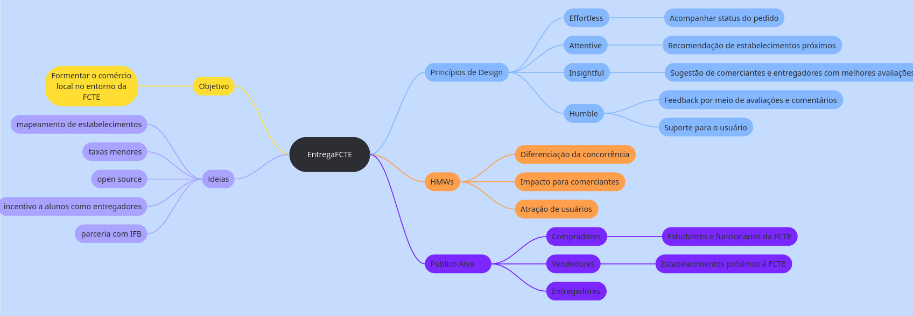

# Mapa Mental

Mapas mentais são ferramentas visuais para organizar ideias de forma clara. Eles começam com uma ideia central e se desdobram em tópicos relacionados, mostrando as conexões entre as informações. Essa técnica é ótima para o início de um projeto, ajudando a estruturar o pensamento e a identificar os elementos-chave.

## Aplicação

O mapa mental foi estruturado usando como base as etapas 'Understand' e 'Define' da Design Sprint, momentos onde estávamos criando maior conhecimento sobre o aplicativo que seria criado, levando em consideração os debates da equipe e principalmente os tópicos que obtiveram maiores votos nas votações por pontos.

_Observação: O mapa mental foi estruturado pelas participantes [Ana Clara](https://github.com/anabborges) e [Gabriela]("https://github.com/anabborges") porém **todos os membros contribuíram com as discussões** para ele que foram realizadas durante as etapas 'Understand' e 'Define' da Design Sprint._

## Detalhes da Entrega

Esta seção cita os membros que participaram do artefato.

### Quadro de Participações

| Membro da Equipe                                              |
| :------------------------------------------------------------ |
| [Ana Clara](https://github.com/anabborges)                    |
| [Ana Joyce](https://github.com/anajoyceamorim)                |
| [Cayo](https://github.com/Cayoalencar)                        |
| [Fabio](https://github.com/fabinsz)                           |
| [Gabriela](https://github.com/gaubiela)                       |
| [Guilherme Storch](https://github.com/storch7)                | 
| [João Filipe](https://github.com/Joao151104)                  |
| [Luiz Guilherme](https://github.com/luizfaria1989)            |
| [Nathan](https://github.com/Nathan-bs)                        |
| [Rodrigo](https://github.com/rodrigoFAmaral)                  |
| [Willian](https://github.com/Wooo589)                         |

---

## Histórico de Versões

| **Data**       | **Versão** | **Descrição**                         | **Autor**                                      | **Revisor**                                      | **Data da Revisão** |
| :--------: | :----: | :-------------------------------- | :----------------------------------------: | :----------------------------------------: | :-------------: |
| 04/09/2025 |  `1.0`   | Criação do documento. | [`@Ana Clara`](https://github.com/anabborges) | [`@`](https://github.com/) |   00/00/0000    |
| 04/09/2025 |  `1.1`   | Adiciona foto do mapa mental. | [`@Ana Clara`](https://github.com/anabborges) | [`@`](https://github.com/) |   00/00/0000    |