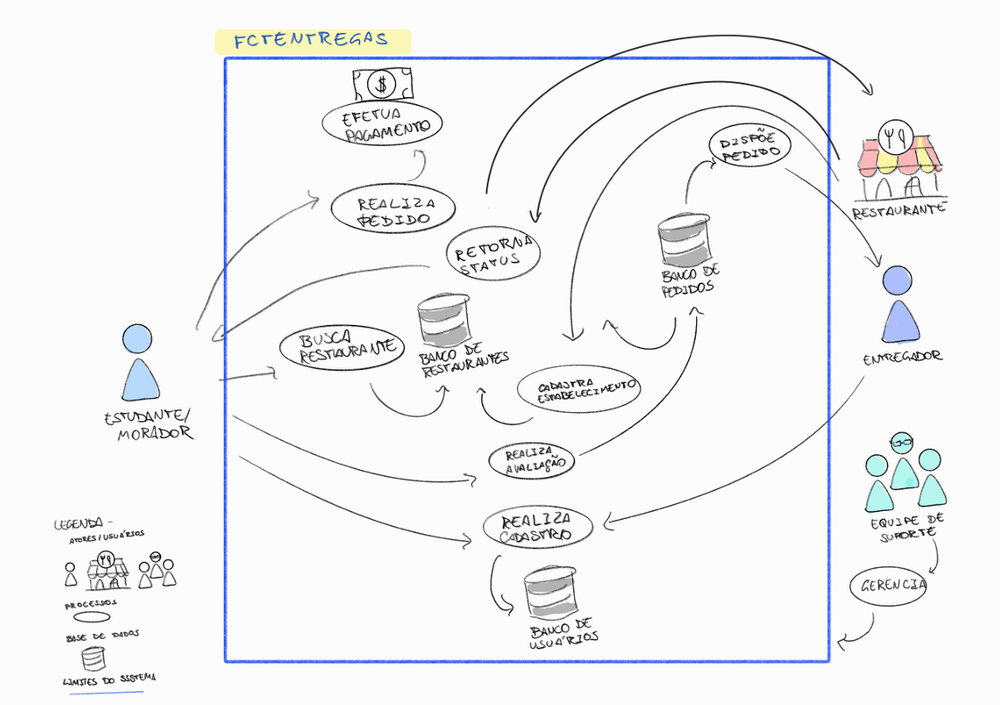
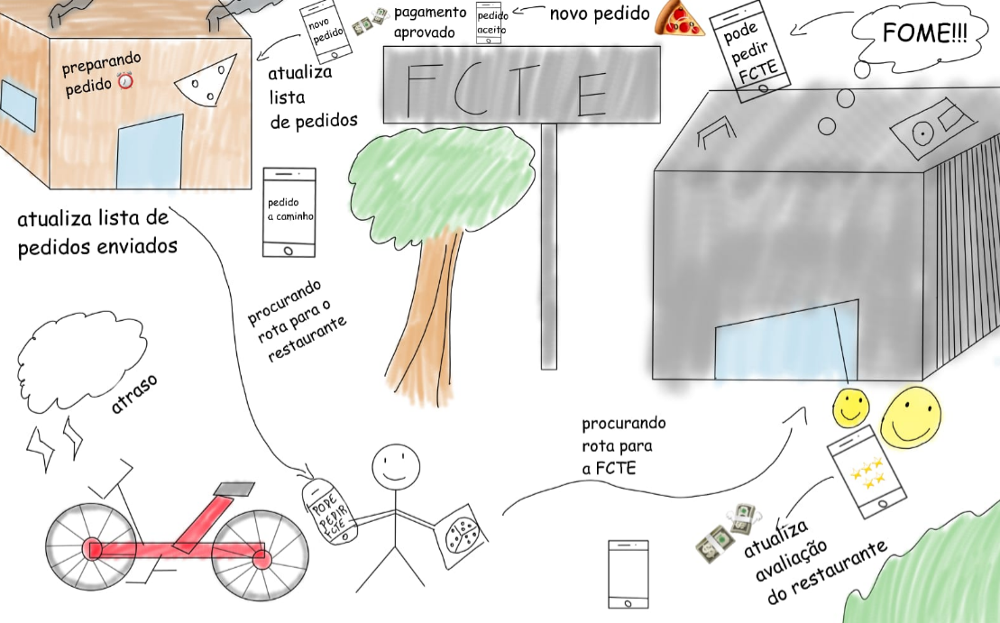
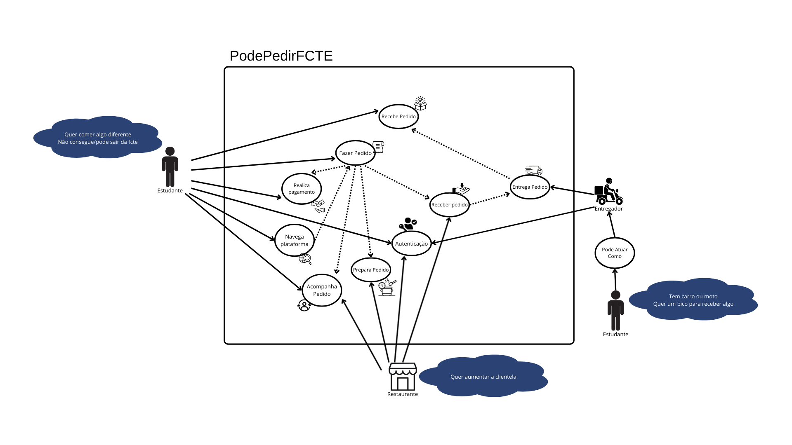

# RICH PICTURE

Rich Picture (ou "Desenho Rico") é uma técnica visual poderosa, usada principalmente em sistemas complexos e mal definidos para representar uma situação de forma abrangente e criativa. Em vez de usar palavras ou fluxogramas rígidos, a técnica encoraja o uso de desenhos, símbolos, ícones e linhas para ilustrar todos os elementos, relações e sentimentos presentes em um problema.

Seu principal objetivo é capturar a essência de uma situação, incluindo não apenas os fatos e dados, mas também as emoções, os conflitos, as percepções e as conexões entre as partes interessadas. O resultado é um "quadro" holístico que ajuda a equipe a ver o cenário completo e a alinhar a compreensão de todos sobre o problema, revelando dinâmicas e tensões que seriam difíceis de expressar com palavras.

Em suma, o Rich Picture é uma ferramenta de exploração e diagnóstico que transforma a complexidade em um mapa visual, facilitando a identificação de pontos de dor e a discussão de possíveis soluções.

### Aplicação da Técnica

A equipe de desenvolvimento do **PodePedirFCTE** criou dois *Rich Pictures* para documentar e visualizar o fluxo de acontecimentos na aplicação. Ambos foram elaborados a partir de *insights* e discussões coletivas em reuniões presenciais e remotas, refletindo um entendimento compartilhado sobre o projeto.

Ambos os *Rich Pictures* tem como objetivo retratar o **fluxo do app**, identificando todos os pontos de atrito, desafios e emoções envolvidos na experiência de pedir comida. Os desenhoa abrangem a jornada completa do usuário.

<strong>Figura 1</strong> – Rich picture da aplicação PodePedirFCTE. 
<strong>Autor</strong> : Gabriela

 
 

<strong>Figura 2</strong> – Rich picture da aplicação PodePedirFCTE. 
<strong>Autor</strong> : Luiz

<strong>Figura 3</strong> – Rich picture da aplicação PodePedirFCTE. 
<strong>Autor</strong> : Rodrigo

---

## Detalhes da Entrega

Esta seção cita os membros que participaram da elaboração do artefato.

### Quadro de Participações

| Membro da Equipe                                              |
| :------------------------------------------------------------ |
| [Cayo](https://github.com/Cayoalencar)                        |
| [Gabriela](https://github.com/gaubiela)                       |
| [Luiz Guilherme](https://github.com/luizfaria1989)            |
| [Rodrigo](https://github.com/rodrigoFAmaral)                  |

---

### Bibliografia

> BETTER EVALUATION. Rich pictures. Disponível em: [https://www.betterevaluation.org/methods-approaches/methods/rich-pictures](https://www.betterevaluation.org/methods-approaches/methods/rich-pictures). Acesso em: 4 set. 2025.

---

### Histórico de Versões

|  **Data**  | **Versão** | **Descrição**        |         **Autor**          |        **Revisor**         | **Data da Revisão** |
| :--------: | :--------: | :------------------- | :------------------------: | :------------------------: | :-----------------: |
| 04/09/2025 |   `1.0`    | Criação do documento | [`@Gabriela Alves`](https://github.com/gaubiela) | [`@`](https://github.com/) |     00/00/0000      |
| 04/09/2025 |   `1.0`    | Adicionando richpicture | [`@Rodrigo Amaral`](https://github.com/rodrigoFAmaral) | [`@`](https://github.com/) |     00/00/0000      |