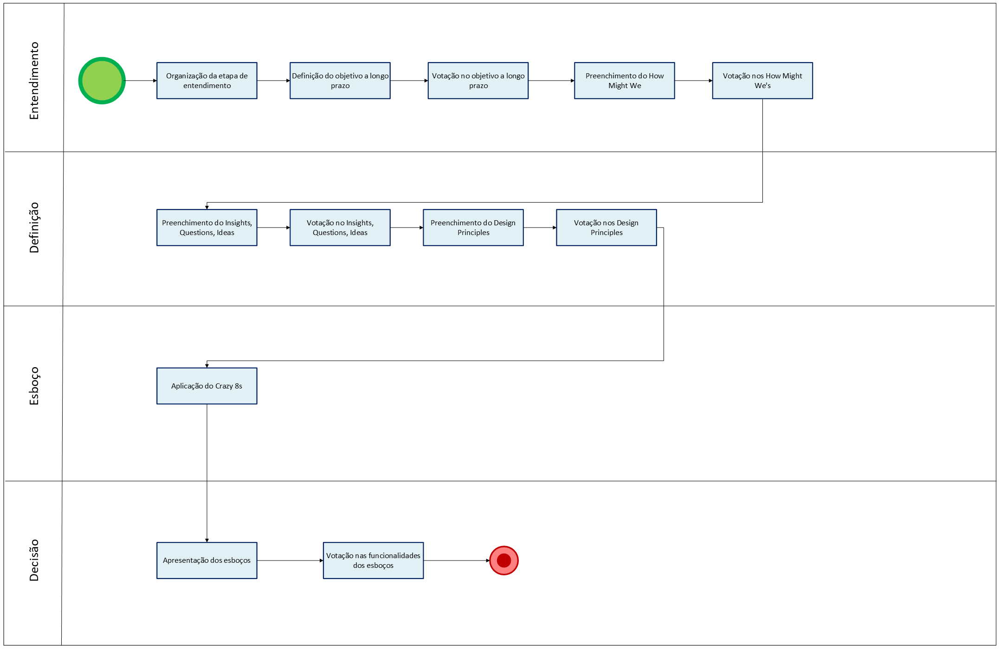

# Fluxo Design Sprint - 4 etapas

O diagrama BPMN construído pela equipe representa as 4 primeiras etapas da Design Sprint realizada. Sendo elas: Understand, Define, Sketch e Decide.

## Entendimento (Understand)

Essa fase teve como foco alinhar as expectativas e incertezas em relação ao projeto, além de gerar uma maior entendimento do projeto:

- Organização da etapa de entendimento
- Definição do objetivo a longo prazo
- Votação no ojetivo a longo prazo
- Preenchimento do How Might We
- Votação nos How Might We's

## Definição (Define)

Essa fase teve como objetivo trazer ideias e expectativas mais concretas para o projeto:

- Preenchimento dos Insights, Questions e Ideas
- Votação nos Insights, Questions e Ideas
- Preenchimento dos Design Principles
- Votação nos Design Principles

## Esboço (Sketch)

Essa fase teve como foco o estimulo a criatividade dos membros para um esboço inicial do aplicativo:

- Aplicação do Crazy 8's

## Decisão (Decide)

Essa fase teve como objetivo decidir funcionalidades essenciais dentro do aplicativo e funcionalidades interessantes de serem implementadas:

- Apresentação dos esboços
- Votação nas funcionalidades dos esboços

## Modelagem BPMN

## Participantes

| Membro da Equipe                                              | Papel/Contribuições na Modelagem BPMN da Design Sprint                                |
| :------------------------------------------------------------ | :-------------------------------------------------------------------- |
| [Ana Clara](https://github.com/anabborges)                    | BPMN da Design Sprint |
| [Luiz Guilherme](https://github.com/luizfaria1989)            | Revisão e ajustes na BPMN da Design Sprint  |

## Referência Bibliogŕafica

> GOOGLE. Design Sprint Kit: Overview. Disponível em: https://designsprintkit.withgoogle.com/methodology/overview.

## Histórico de Versões

| **Data**       | **Versão** | **Descrição**                         | **Autor**                                      | **Revisor**                                      | **Data da Revisão** |
| :--------: | :----: | :-------------------------------- | :----------------------------------------: | :----------------------------------------: | :-------------: |
| 04/09/2025 |  `1.0`   | Criação do documento. | [`@Ana Clara`](https://github.com/anabborges) | [`@Ana Joyce`](https://github.com/anajoyceamorim) |  05/07/2025    |