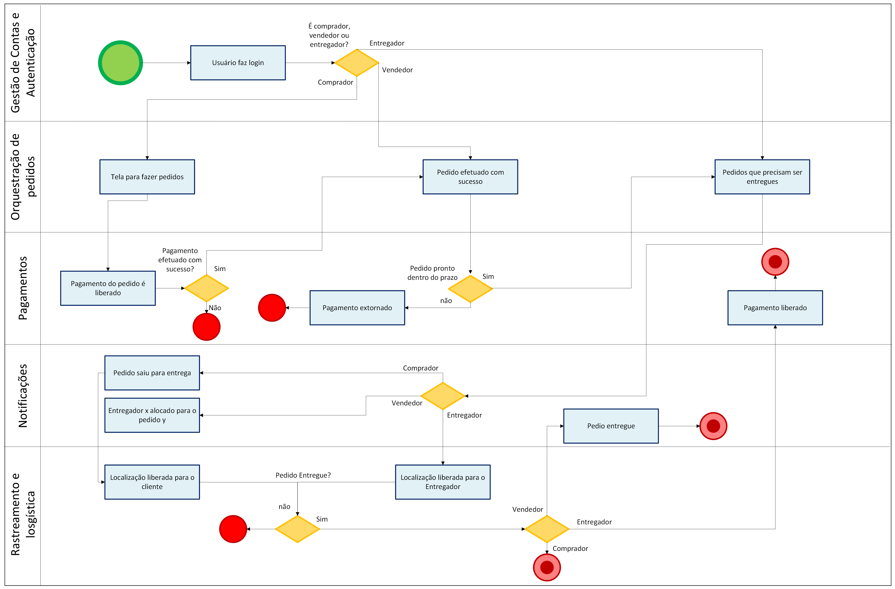
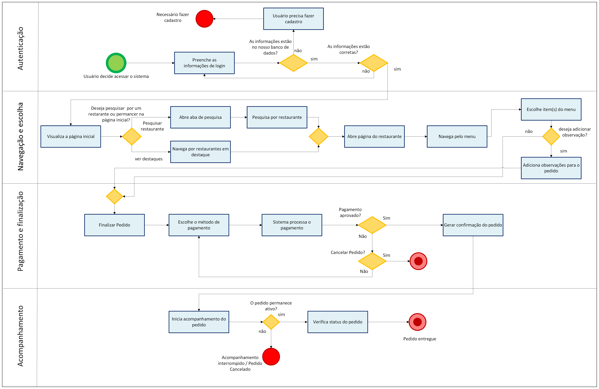
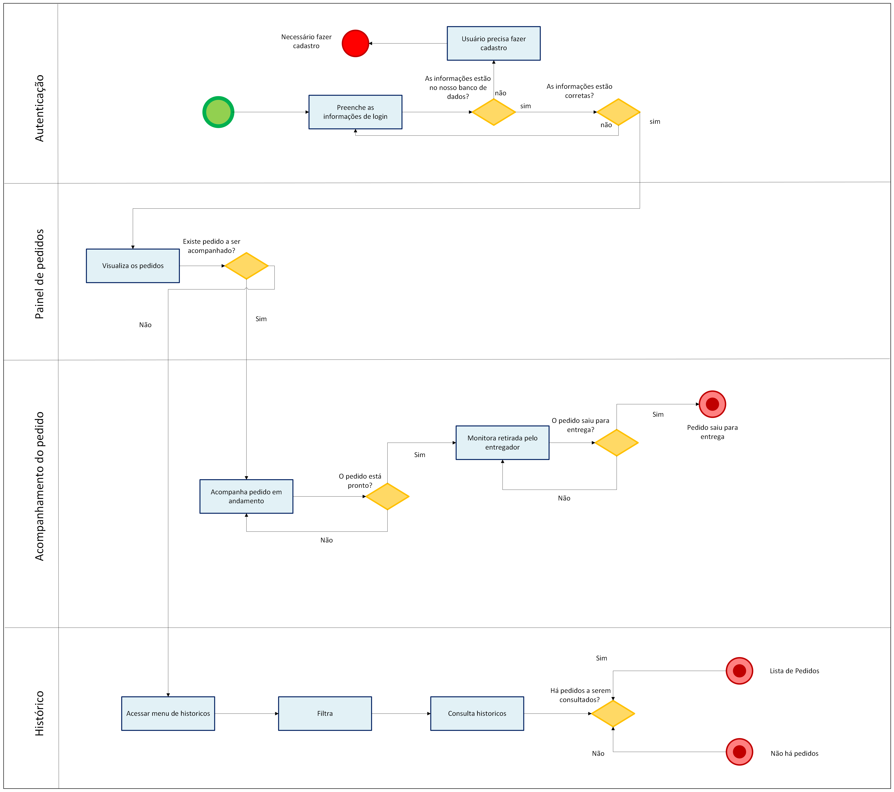
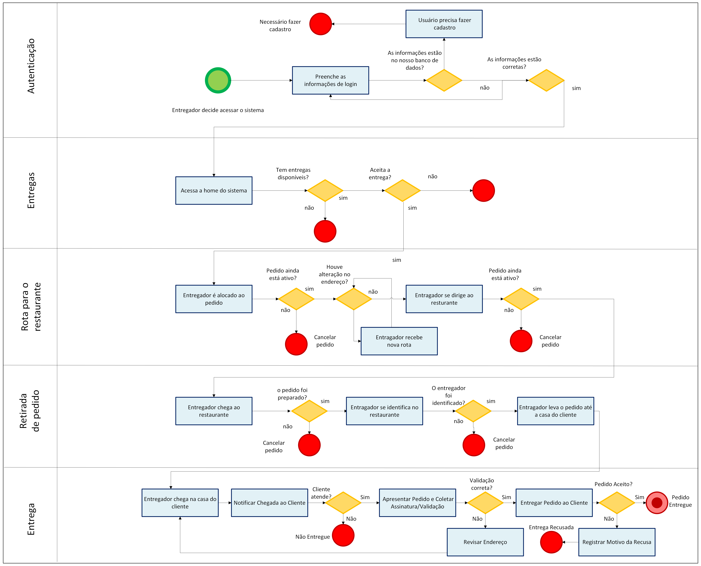

# 1.3. Módulo Modelagem BPMN

## 1. Introdução

A modelagem de processos de negócio (BPMN) é uma ferramenta fundamental para visualizar, analisar e otimizar fluxos de trabalho. Neste documento, aplicamos a notação BPMN para detalhar duas perspectivas cruciais do projeto "PodePedirFCTE":

1.  **A Metodologia de Trabalho:** Como a equipe se organizou para planejar e tomar decisões.
2.  **O Processo do Aplicativo:** Como o sistema funciona do ponto de vista dos seus usuários (Compradores, Vendedores e Entregadores).

## 2. Metodologia de Trabalho

Para garantir um desenvolvimento ágil e focado nas necessidades do usuário, adotamos uma abordagem que combina elementos da Design Sprint com práticas do Scrum. A modelagem a seguir representa o processo que guiou a fase inicial do projeto.

### 2.1. Diagrama da Design Sprint

*   **Descrição:** Este diagrama ilustra as etapas que seguimos durante a nossa Design Sprint, desde o entendimento do problema ("delivery para a comunidade da FCTE") até a validação do protótipo. Ele detalha as atividades, os responsáveis e os artefatos gerados em cada fase, mostrando como as decisões-chave sobre o projeto foram tomadas.

> Design Sprint

Autores: [Ana Clara](https://github.com/anabborges), [Luiz Guilherme](https://github.com/luizfaria1989), 2025.

## 2. Modelagem do Processo Operacional do "PodePedirFCTE"

Os diagramas a seguir detalham o fluxo de funcionamento do aplicativo, mostrando a jornada completa desde o pedido até a entrega.

### 2.1. Diagrama de Colaboração (Visão Geral)

*   **Descrição:** Este é o diagrama principal que integra as três partes fundamentais do nosso sistema: **Compradores**, **Vendedores** e **Entregadores**. Ele mostra como os diferentes atores interagem, as mensagens que trocam (ex: "Novo Pedido", "Pedido Pronto para Retirada") e como o processo flui de ponta a ponta.

> Visão Geral

Autor: [Ana Joyce](https://github.com/anajoyceamorim), 2025.

### 2.2. Detalhamento dos Processos por Ator

A seguir, detalhamos o processo interno de cada um dos participantes.

#### 2.2.1. Processo do Comprador

*   **Descrição:** Este diagrama foca exclusivamente na jornada do cliente, desde a abertura do aplicativo, escolha do estabelecimento e do produto, até o pagamento e recebimento do pedido.

> Comprador

Autores: [Ana Joyce](https://github.com/anajoyceamorim),  [Luiz](https://github.com/luizfaria1989),  [Fábio](https://github.com/fabinsz),  [Gabriela](https://github.com/gaubiela), 2025.

#### 2.2.2. Processo do Vendedor

*   **Descrição:** Detalha o fluxo do lado do estabelecimento: recebimento de um novo pedido, preparo, e notificação de que o pedido está pronto para ser retirado pelo entregador.

> Vendedor

Autores: [Ana Joyce](https://github.com/anajoyceamorim),  [Ana Clara](https://github.com/anabborges),  [Willian](https://github.com/Wooo589),  [João](https://github.com/Joao151104), 2025.

#### 2.2.3. Processo do Entregador

*   **Descrição:** Mostra a jornada do entregador, que inclui a aceitação de uma nova entrega, a retirada do pedido no estabelecimento e a finalização da entrega ao comprador.

> Entregador

Autores: [Guilherme Storch](https://github.com/storch7), [Nathan](https://github.com/Nathan-bs),  [Gabriela](https://github.com/gaubiela),  [Rodrigo](https://github.com/rodrigoFAmaral), [Cayo](https://github.com/Cayoalencar), 2025.

## 3. Detalhes da Entrega

Esta seção detalhe a contribuição de cada membro.

### 3.1. Quadro de Participações

| Membro da Equipe                                              | Papel/Contribuições na Modelagem BPMN                                 |
| :------------------------------------------------------------ | :-------------------------------------------------------------------- |
| [Ana Clara](https://github.com/anabborges)                    | BPMN da Design Sprint e a raia "Painel de Pedidos" da pool "Vendedor" |
| [Ana Joyce](https://github.com/anajoyceamorim)                | BPMN da Visão Geral e a raia "Autenticação" das pool "Comprador" e "Vendedor" |
| [Cayo](https://github.com/Cayoalencar)                        | raia "Entrega" da pool "Entregador"                                   |
| [Fabio](https://github.com/fabinsz)                           | raia "Pagamento e finalização" da pool "Comprador"                    |
| [Gabriela](https://github.com/gaubiela)                       | raia "Acompanhamento" da pool "Comprador" e raia "Rota para o restaurante" da pool "Entregador" |
| [Guilherme Storch](https://github.com/storch7)                | raia "Autenticação" da pool "Entregador"                              |
| [João Filipe](https://github.com/Joao151104)                  | raia "Histórico" da pool "Vendedor"                                   |
| [Luiz Guilherme](https://github.com/luizfaria1989)            | BPMN da Design Sprint e a raia "Navegaçã e escolha" da pool "Comprador"  |
| [Nathan](https://github.com/Nathan-bs)                        | raia "Entregas disponíveis" da pool "Entregador"                      |
| [Rodrigo](https://github.com/rodrigoFAmaral)                  | raia "Retirada de pedido" da pool "Entregador"                        |
| [Willian](https://github.com/Wooo589)                         | raia "Acompanhamento" da pool "Vendedor"                              |

### 3.2. Referências

*   BPMN.org. Business Process Model and Notation. Disponível em: <https://www.bpmn.org/>.

### 3.3. Histórico de Versões

| **Data**       | **Versão** | **Descrição**                         | **Autor**                                      | **Revisor**                                      | **Data da Revisão** |
| :--------: | :----: | :-------------------------------- | :----------------------------------------: | :----------------------------------------: | :-------------: |
| 05/09/2025 |  `1.0`   | Criação do documento e adição do diagramas | [`@Ana Joyce`](https://github.com/anajoyceamorim) | [`@Ana Clara`](https://github.com/anabborges) |   05/09/2025    |
