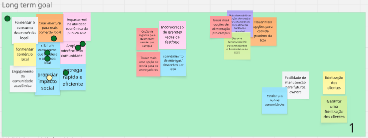
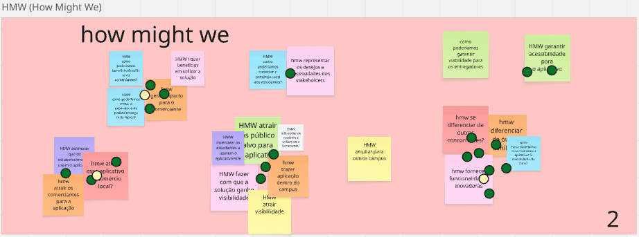

# 1.1.1. Understand (Compreender)

A etapa de **Compreender** representa o pontapé inicial da investigação do cerne do problema que a equipe deve trabalhar em todas as etapas da Design Sprint. Durante essa análise, a equipe se reúne para discutir as esferas que tangem esse problema, sendo que as mais comuns envolvem o público-alvo, o mercado atual e os competidores.

Diante desse cenário, a equipe utilizou duas técnicas para chegar à compreensão do negócio: Long Term Goal e How Might We.

## Long Term Goal
A técnica consiste em os participantes sugerirem possíveis objetivos que o negócio deve atingir. Durante esse período de divergência, espera-se que um mesmo objetivo apareça descrito de maneiras diferentes ou semelhantes por cada membro da equipe, o que conduz à fase de convergência de ideias. Após essa etapa de formulação, a equipe deve chegar a um consenso acerca de um objetivo de longo prazo para o negócio por meio de uma votação. O objetivo mais votado será definido como aquele que o grupo deve alcançar ao final do desenvolvimento da ideia.

Na Figura 1, encontra-se o registro do uso dessa técnica pelo grupo.

<strong>Figura 1</strong> – Uso da técnica Long Term Goal pela equipe PodePedirFCTE no Miro.

## How Might We (HMW)
Nesse método, a equipe deve escrever possíveis oportunidades, ou até transformar gargalos em oportunidades, que possam orientar a equipe a transformar desafios em possibilidades, o que evita discussões improdutivas ou soluções precipitadas. Após isso, deve-se mapear as oportunidades em categorias para facilitar a identificação do assunto que cada uma aborda, e cada membro deve explicar o significado daquilo que apresentou. Por fim, realiza-se uma votação, em que cada participante dispõe de 3 votos para destacar as oportunidades que considera mais relevantes, priorizando sua importância para os usuários e ajudando a equipe a focar nas melhores ideias apresentadas.
 
Na Figura 2 abaixo, mostra-se o uso dessa técnica pelo grupo.

<strong>Figura 2</strong> – Aplicação da técnica How Might We pela equipe PodePedirFCTE no Miro.

## Referencial Bibliográfico

> GOOGLE. How Might We. Disponível em: https://designsprintkit.withgoogle.com/methodology/phase1-understand/hmw-sharing-and-affinity-mapping.

> GOOGLE. HMW Sharing and Affinity Mapping. Disponível em: https://designsprintkit.withgoogle.com/methodology/phase1-understand/method-1.

> GOOGLE. HMW Voting. Disponível em: https://designsprintkit.withgoogle.com/methodology/phase1-understand/hmw-voting.

> GOOGLE. Phase 1: Understand. Disponível em: https://designsprintkit.withgoogle.com/methodology/phase1-understand.

## Histórico de Versões
| **Data**       | **Versão** | **Descrição**                         | **Autor**                                      | **Revisor**                                      | **Data da Revisão** |
| :--------: | :----: | :-------------------------------- | :----------------------------------------: | :----------------------------------------: | :-------------: |
| 04/09/2025 |  `1.0`   | Criação do documento | [`@Willian`](https://github.com/Wooo589) | [`@`](https://github.com/) |   00/00/0000    |
