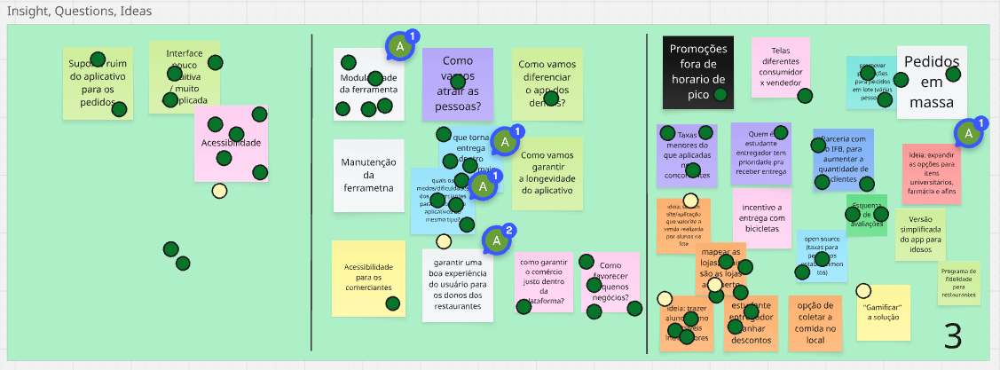
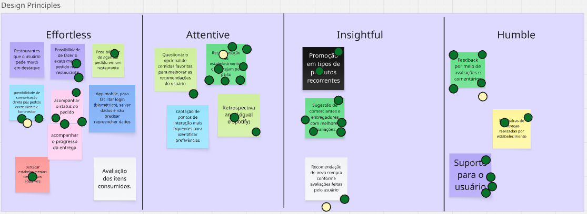

# Define (Definir)

A fase **"Definir"** é a segunda etapa de um Design Sprint, sucedendo a fase de "Compreender". Seu propósito é filtrar a grande quantidade de informações e dados coletados para focar em uma meta clara e alcançável. É o momento de traduzir a pesquisa e os *insights* em um problema bem definido que a equipe tentará resolver.

Para essa etapa, foram usadas duas técnicas principais:

1.  **Insights, Questions, Ideas (IQI):**
    Esta técnica ajuda a equipe a organizar e processar os dados de forma estruturada, facilitando a transição da pesquisa para a ação.
    * **Insights (Percepções):** São as observações e conclusões que emergem dos dados de pesquisa. Eles são a base para o trabalho futuro.
    * **Questions (Perguntas):** São as dúvidas que surgem a partir dos *insights*. Elas indicam lacunas de conhecimento e são frequentemente transformadas em perguntas do tipo "Como podemos..." para guiar a etapa de ideação.
    * **Ideas (Ideias):** São as soluções preliminares que a equipe começa a esboçar. Elas são inspirações que surgem ao responder às perguntas e aos *insights*.

    A técnica IQI evita que a equipe pule diretamente de um problema para uma solução, garantindo que as ideias propostas sejam fundamentadas em uma compreensão sólida dos desafios e das necessidades.

2.  **Princípios de Design (Design Principles):**
    São os valores e as regras que a equipe define para guiar a criação do produto ou solução. Eles funcionam como um mapa para a tomada de decisões, ajudando a garantir que o produto final seja coerente e alinhado com a visão estabelecida.
    * **Características:** Princípios de design devem ser concisos, fáceis de lembrar e específicos para o projeto.
    * **Como eles ajudam:** Ao enfrentar uma decisão difícil, a equipe pode se perguntar "Essa escolha está de acordo com nossos princípios de design?" Isso simplifica a priorização e mantém o foco no que realmente importa.

Em resumo, a fase **"Definir"** é a bússola do Design Sprint. Ela transforma a ampla coleta de dados em um plano de ação claro, permitindo que a equipe se mova para as próximas etapas (Idear, Prototipar e Testar) com um propósito bem definido e alinhado.

### Condução das Técnicas

A experiência do grupo utilizando o Miro para a fase "Definir" do Design Sprint, com sessões cronometradas para cada técnica, foi extremamente produtiva e democrática. Essa abordagem estruturada permitiu que todos os integrantes participassem ativamente, contribuindo com suas perspectivas e ideias de forma organizada.

#### **IQI (Insights, Questions, Ideas)**

A técnica de votação para o IQI foi crucial para a priorização. Com cada um dos 11 membros tendo:

* **1 voto para insights:** A equipe pôde destacar as percepções mais relevantes e impactantes, garantindo que o grupo concordasse com as descobertas mais importantes do processo de pesquisa.
* **2 votos para perguntas:** Ter dois votos permitiu que cada pessoa pudesse enfatizar as duas perguntas que consideravam mais cruciais para o sucesso do projeto. Isso ajudou a identificar as maiores lacunas de conhecimento e a focar nos desafios mais urgentes.
* **3 votos para ideias:** A distribuição de três votos para ideias estimulou a criatividade e a diversidade de pensamento. Os membros puderam dar mais peso às soluções que consideravam mais inovadoras ou viáveis, resultando em um conjunto de ideias mais robusto e bem apoiado pelo grupo.

O uso dos pontinhos verdes para a votação tornou o processo visual e transparente. A concentração desses votos indicou claramente quais elementos (insights, perguntas e ideias) a maioria do grupo considerava mais importantes, agilizando a tomada de decisão e o alinhamento (Figura 1).

<strong>Figura 1</strong> – Quadro colaborativo da técnica *Insights, Questions, Ideas (IQI) aplicado no Miro durante a fase “Definir” do Design Sprint.

#### **Design Principles**

A técnica de um voto por parte para os Princípios de Design foi ideal para garantir que cada categoria (Effortless, Attentive, Insightful, Humble) recebesse a devida atenção. Ao limitar a um voto por parte, a equipe foi forçada a fazer uma escolha cuidadosa e a considerar o que era mais importante para a essência do produto em cada categoria. Isso evitou que a votação fosse dispersa e ajudou a criar princípios de design mais focados e significativos.

<strong>Figura 2</strong> – Quadro colaborativo da técnica Design Principles aplicado no Miro durante a fase “Definir” do Design Sprint.

---

Em suma, a combinação de sessões com tempo definido e um sistema de votação ponderado no Miro transformou a colaboração de 11 pessoas em um processo coeso. A abordagem garantiu que cada voz fosse ouvida e que as decisões finais fossem baseadas no consenso e na priorização coletiva, levando a uma fase "Definir" bem-sucedida e a um plano de ação claro para as próximas etapas do Design Sprint.

---

### Bibliografia

> GOOGLE. Design Sprint Kit – Design Principles. Disponível em: [https://designsprintkit.withgoogle.com/methodology/phase2-define/design-principles](https://designsprintkit.withgoogle.com/methodology/phase2-define/design-principles). Acesso em: 4 set. 2025.

> GOOGLE. Design Sprint Kit – Insights, Questions, Ideas (IQI). Disponível em: [https://designsprintkit.withgoogle.com/methodology/phase2-define/insights-questions-ideas-iqi](https://designsprintkit.withgoogle.com/methodology/phase2-define/insights-questions-ideas-iqi). Acesso em: 4 set. 2025.

> GOOGLE. Design Sprint Kit – Phase 2: Define. Disponível em: [https://designsprintkit.withgoogle.com/methodology/phase2-define](https://designsprintkit.withgoogle.com/methodology/phase2-define). Acesso em: 4 set. 2025.

---

### Histórico de Versões

|  **Data**  | **Versão** | **Descrição**        |         **Autor**          |        **Revisor**         | **Data da Revisão** |
| :--------: | :--------: | :------------------- | :------------------------: | :------------------------: | :-----------------: |
| 04/09/2025 |   `1.0`    | Criação do documento | [`@Gabriela Alves`](https://github.com/gaubiela) | [`@`](https://github.com/) |     00/00/0000      |