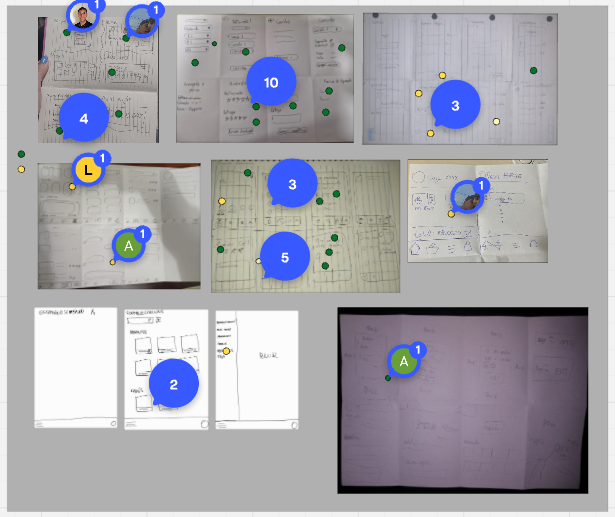
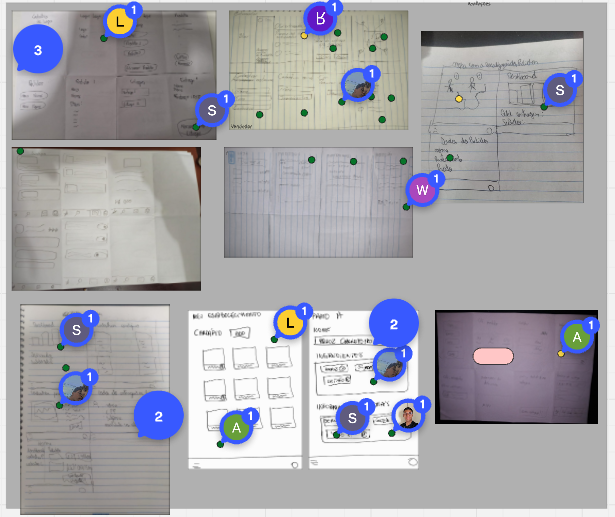
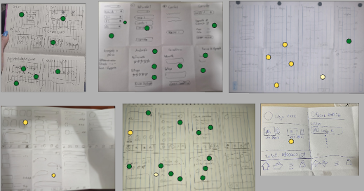
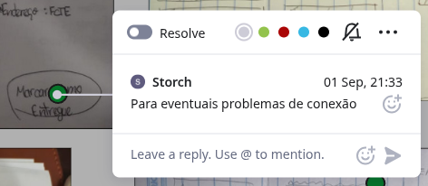
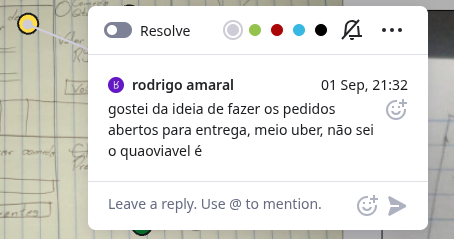
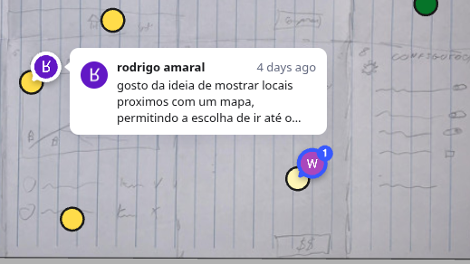

# 4. Decide

Nesta fase da Design Sprint, o objetivo é analisar criticamente todas as soluções esboçadas na fase anterior e decidir qual delas tem o maior potencial para ser prototipada e testada. A decisão não é baseada em um debate aberto, mas sim em um processo estruturado para garantir que todas as ideias sejam consideradas de forma justa.

## Passos da Fase "Decide"

### 1. Museu de Arte (Art Museum)

Nesta etapa todas as soluções esboçadas são exibidas, como em uma galeria de arte. Isso permite que a equipe veja todas as opções de uma só vez, de forma anônima.

*   **Ação:** Os esboços de solução, gerados a partir do exercício Crazy 8's, foram organizados no nosso quadro do Miro.
*   **Link para o Miro/Imagens:**
    <iframe width="768" height="496" src="https://miro.com/app/live-embed/uXjVJPNbTFs=/?focusWidget=3458764639008047782&embedMode=view_only_without_ui&embedId=358205007853" frameborder="0" scrolling="no" allow="fullscreen; clipboard-read; clipboard-write" allowfullscreen></iframe>  

  

### 2. Mapa de Calor (Heat Map)

Nesta etapa, cada membro da equipe revisou silenciosamente os esboços e utilizou pontos de votação (bolinhas na cor verde) em nosso quadro do Miro para indicar as ideias ou partes de ideias que mais lhes agradavam. Permitindo que todos destacassem livremente os pontos de interesse.

*   **Ação:** A votação foi realizada no Miro, com cada integrante arrastando "bolinhas" para as áreas dos esboços que desejava destacar.
*   **Resultado:**  
       
    *   **Principais áreas de interesse identificadas:**  
        *   Login/Cadastro
        *   Home Page
        *   Avaliação
        *   Acompanhamento

### 3. Crítica Rápida (Speed Critique)

A equipe discute cada esboço. Para cada solução:
1.  O facilitador apresenta o esboço.
2.  A equipe discute os destaques (as áreas com mais pontos do mapa de calor).
3.  O criador do esboço permanece em silêncio até o final, quando pode esclarecer qualquer ponto que tenha sido mal interpretado.

*   **Ação:** As discussões foram realizadas para cada esboço.
*   **Exemplo das Críticas:**  
     
     
     

### 4. Ideias para o Futuro (Votação com Pontos Amarelos)

Durante a fase de decisão, a equipe também utilizou um sistema de votação com pontos amarelos para destacar ideias que, embora interessantes e valiosas, não eram a prioridade para o protótipo a ser desenvolvido nesta Design Sprint. Essas ideias foram marcadas como potenciais features a serem consideradas em futuras iterações do produto.

*   **Ação:** Cada membro da equipe pode colocar pontos amarelos em funcionalidades ou conceitos que considerou promissores para o futuro. Comentários foram adicionados para explicar o porquê da escolha.
*   **Resultado:** As ideias marcadas com pontos amarelos foram documentadas no Miro para referência futura.
     

## Conclusão: O que será Prototipado

Com base na decisão final, as seguintes ideias serão levadas para a fase de prototipagem:

*   **Principais Componentes/Telas a serem prototipados:**
    *   **Visão Geral:**
        *   Login + Cadastro
    *   **Visão do Comprador:**
        *   Visualizar restaurantes
        *   Visualizar Cardápios
        *   Realizar Pedido
        *   Pagar Pedido
        *   Acompanhar pedido
        *   Avaliar Pedido
    *   **Visão do Vendedor:**
        *   CRUD de Estabelecimento
        *   CRUD de Cardápio
        *   Receber pedidos de encomendas
        *   Atualizar Status do Pedido
        *   Enviar pedido
        *   Dashboard de Vendas
    *   **Visão do Entregador:**
        *   Buscar Pedido
        *   Entregar Pedido
        *   Dashboard de Entregas

## Referências

> - <https://designsprintkit.withgoogle.com/methodology/phase4-decide>
> - <https://designsprintkit.withgoogle.com/methodology/phase4-decide/present-solution-sketches>
> - <https://designsprintkit.withgoogle.com/methodology/phase4-decide/heatmap-voting>

### Histórico de Versões

|  **Data**  | **Versão** | **Descrição**        |         **Autor**          |        **Revisor**         | **Data da Revisão** |
| :--------: | :--------: | :------------------- | :------------------------: | :------------------------: | :-----------------: |
| 05/09/2025 |   `1.0`    | Adição da Documentação | [`@Ana Joyce`](https://github.com/anajoyceamorim) | [`@`](https://github.com/) |     00/00/0000      |