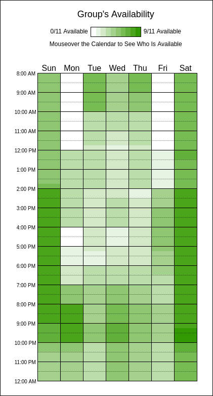

# Heatmap

A fim de entender a disponibilidade de cada um dos membros do grupo, criamos um Heatmap que nos auxiliou para o agendamento de momentos para o projeto ser discutido, planejado e executado.

## Ferramenta

Para facilitar esse processo, utilizamos o site [When2Meet](https://www.when2meet.com/), no qual cada um dos integrantes selecionou os horários livres. Esse é o heatmap após preenchido pelos membros:

## Reunião

Ficou definido que nossa reunião seria na Segunda às 20h, podendo ter reuniões em outros momentos a depender da necessidade.

# Histórico de Versões

| **Data**       | **Versão** | **Descrição**                         | **Autor**                                      | **Revisor**                                      | **Data da Revisão** |
| :--------: | :----: | :-------------------------------- | :----------------------------------------: | :----------------------------------------: | :-------------: |
| 04/09/2025 |  `1.0`   | Criação da página do heatmap. | [`@Ana Clara`](https://github.com/anabborges) | [`@`](https://github.com/) |   00/00/0000    |